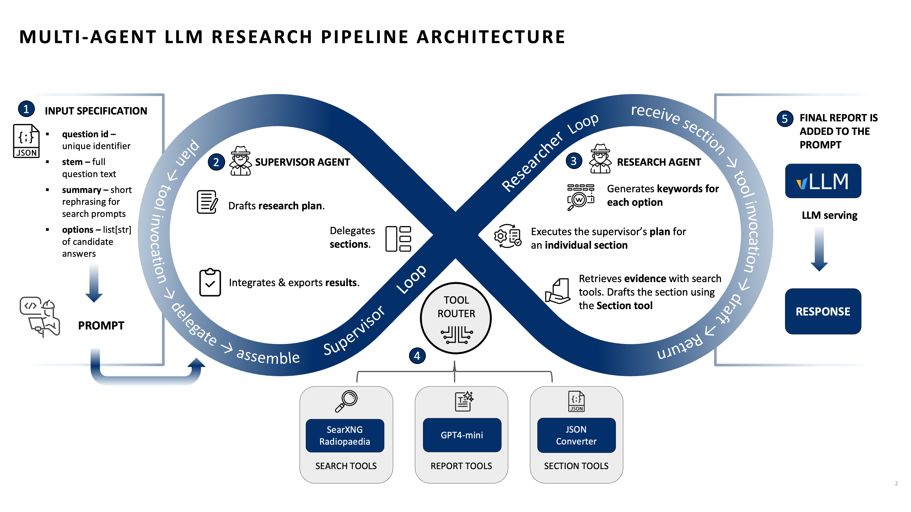

# Agentic Retrieval for Radiology QA (AgenticRAG)

## Overview
This is the official repository of the paper **Agentic large language models improve retrieval-based radiology question answering**.

Preprint version: [insert URL].

AgenticRAG is an open-source, multi-agent retrieval-augmented generation (RAG) pipeline designed for evidence-grounded radiology question answering. It orchestrates a **supervisor–researcher** workflow where the supervisor decomposes a clinical question into diagnostic sections, assigns each to a research agent, and then synthesizes an unbiased, structured report. Retrieval is iterative and targeted, improving factual grounding and diagnostic accuracy over conventional single-step RAG. This repository contains the implementation, tooling, and orchestration for the pipeline described in the accompanying paper.


Briefly, the system:
- Decomposes radiology questions into diagnostic options.
- Assigns each option to a research agent that iteratively retrieves evidence (from Radiopaedia.org) via a locally hosted SearXNG instance.
- Supervises and composes evidence into introduction, body sections, and conclusion with neutrality.
- Persists intermediate and final reports safely to support resumption and evaluation.

## 🔍 Key Features

- **Supervisor–Researcher Multi-Agent Graph**: Coordinated via a stateful directed graph (`agentic_workflow.py`) using LangGraph.
- **Iterative, Agentic Retrieval**: Each research agent refines search queries to gather clinically relevant evidence.
- **Structured Report Generation**: Tools for planning sections, writing introductions/conclusions, and composing final reports.
- **Configurable Models**: Plug in different LLMs (OpenAI, Groq, Ollama, custom gateways) with support for function/tool calling.
- **Robust Persistence**: Incremental NDJSON streaming with consolidation to avoid recomputation on interruptions.


*Figure 1: AgenticRAG pipeline overview.*

## 🚀 Quickstart

### 1. Clone and install

```bash
git clone https://github.com/sopajeta/agentic-retrieval.git
cd agentic-retrieval
uv venv
source .venv/bin/activate  # On Windows: .venv\Scripts\activate
curl -LsSf https://astral.sh/uv/install.sh | sh # On Windows and Linux: pip install -e .
```

### 2. Environment

Copy and edit your `.env` to configure model endpoints, API keys, and search host:

```bash
cp .env.example .env
```

#### Required (pick **only one** of the following, depending on which backend you’re using)
- `OPENAI_API_KEY` – for OpenAI models.  
- `GROQ_API_KEY` – for Groq models. (You can also optionally set `GROQ_BASE_URL` if you need to override the default endpoint.)  
- `OLLAMA_BASE_URL` – for a local Ollama model server (no API key needed).  
- `CUSTOM_API_URL` / `CUSTOM_BASE_URL` / `BASE_URL` – for a custom gateway; set the appropriate base URL your custom integration expects.  

> ⚠️ Only one of the above model/backends should be configured at a time (e.g., either OpenAI or Groq or Ollama or your custom endpoint), unless you intentionally mix multiple for comparison.

#### Optional overrides (modify only if you want behavior different from the defaults)
- `SUPERVISOR_MODEL`, `RESEARCHER_MODEL` – model strings, e.g., `openai:gpt-4.1-mini`.  
- `SEARXNG_HOST` – URL for your SearXNG instance (defaults to `http://localhost:8080`).  
- `SEARXNG_ALLOWED_DOMAINS` – comma-separated allowed domains for search (defaults to `radiopaedia.org`).

### 3. Run SearXNG (search backend)

The pipeline uses a locally hosted SearXNG instance for web retrieval. Launch with Docker. See the **official SearXNG Docker installation & launch instructions** for details: https://docs.searxng.org/installation/docker.html

Simple launch example:

```bash
docker compose up -d
```

Ensure the URL (e.g., `http://localhost:8080`) is reflected via `SEARXNG_HOST` if customized.

### 4. Launch the agentic RAG workflow

### 4. Launch the agentic RAG workflow

The entrypoint script for batch processing is `stream_agenticRAG.py`. The workflow expects a JSON input file (e.g., `dataset_example.json`) containing a list of questions. Each entry must include the following keys:
- `question_id`: a unique identifier for the question.
- `summary`: the clinical question or prompt summary.
- `options`: an object/dictionary of **exactly four** diagnostic choices (e.g., labeled `"A"`, `"B"`, `"C"`, `"D"`).

**Note:** This system is designed for **multiple-choice questions (MCQs)** with exactly four options; the pipeline allocates one research agent per option.

Minimal example:

```json
[
  {
    "question_id": 123,
    "summary": "A 65-year-old male with chest pain and shortness of breath.",
    "options": {
      "A": "Myocardial infarction",
      "B": "Pulmonary embolism",
      "C": "Pneumonia",
      "D": "Aortic dissection"
    }
  }
] ```json

Run the workflow:

```bash
python stream_agenticRAG.py
```

**Note:** This system is designed for **multiple-choice questions (MCQs)** with **exactly four options**. Each question should have four diagnostic choices (e.g., labeled `"A"`, `"B"`, `"C"`, `"D"`), and the pipeline will allocate one research agent per option.

You can launch an interactive LangGraph window / chat interface to drive and inspect the AgenticRAG workflow.
```bash
uvx --refresh --from "langgraph-cli[inmem]" --with-editable .  # On Window / Linux: pip install -U "langgraph-cli[inmem]" 
--python 3.11 langgraph dev --allow-blocking   # On Window / Linux: langgraph dev
```


### 5. Custom invocation / configuration

The core graph is defined in `agentic_workflow.py`. The runner orchestrating questions is `runner.py`, which uses the graph to generate reports. You can adjust:
- Input question file (JSON list of questions).
- Supervisor/researcher models via `.env` or runtime overrides.
- Search parameters (domain filtering, number of queries, depth) via `Configuration` and `RunnableConfig`.


## 🔎 Search Tool

Search is implemented against a configured SearXNG instance in `utils.py`:

- `searxng_search` tool performs asynchronous queries, applies domain filtering (defaults to `radiopaedia.org`), deduplicates results, and formats them into markdown bundles for LLM consumption.
- Query construction can automatically constrain to allowed domains via site clauses.
- Retrieval is integrated into the supervisor/research pipeline as tools in `agentic_workflow.py`.

## 🧠 Multi-Agent Architecture

Implemented in `agentic_workflow.py`:
- **Supervisor Agent**: Plans report sections, triggers introduction/conclusion generation, and orchestrates research agents.  
- **Research Agents**: Work on individual diagnostic options, perform iterative evidence retrieval, and produce section content.  
- State transitions and continuation logic are encoded with `StateGraph` and conditional edges.

## 🗂 File Overview

- `agentic_workflow.py` – Core multi-agent supervisor/researcher graph and tool orchestration.  
- `runner.py` – Drives batch question processing, invoking the graph and persisting reports.  
- `stream_agenticRAG.py` – Lightweight CLI wrapper around `runner.py` for running a set of radiology questions.  
- `configuration.py` – Central configuration merging env vars and runtime overrides.  
- `utils.py` – Search backend (SearXNG) helpers, model initialization, formatting, and filtering logic.  
- `dataset.py` – Input question loading and report validity checks.  
- `persistence.py` – NDJSON append/rewriting and consolidation logic.  
- `langgraph.json` – LangGraph manifest pointing to the graph entrypoint.  

## 🧩 Model Integration

Supported model prefixes in `utils.init_chat_model`:
- `openai:` – OpenAI endpoints (via `OPENAI_API_KEY`).
- `groq:` – Groq models (requires `GROQ_API_KEY`).
- `ollama:` – Local Ollama-hosted models.
- `custom:` – Custom gateway configured via `CUSTOM_BASE_URL` / `CUSTOM_API_URL`.

Ensure the chosen models support tool/function calling for structured report assembly.

## 📘 Paper / Context
  
This repository implements the system described in:

> **Agentic large language models improve retrieval-based radiology question answering**  
> The pipeline systematically evaluates 24 LLMs across model scales and training paradigms on 104 expert-curated radiology multiple-choice questions. Agentic retrieval decomposes questions, iteratively gathers targeted clinical evidence from Radiopaedia.org, and synthesizes unbiased reports, yielding substantial improvement in diagnostic accuracy and factual grounding, especially for small and mid-sized models.


## Citation

This repository implements the system described in:

In case you use this repository, please also cite the related prior work:
> **Agentic large language models improve retrieval-based radiology question answering**  
> Sebastian Wind, Jeta Sopa, Daniel Truhn, Mahshad Lotfinia, Tri-Thien Nguyen, Keno Bressem, Lisa Adams, Mirabela Rusu, Harald Köstler, Gerhard Wellein, Andreas Maier, Soroosh Tayebi Arasteh. Preprint. [Insert DOI or publication details when available.]


**BibTeX for Agentic RAG**
```bibtex
@article {AgenticRAG,
  author = {Wind, Sebastian and Sopa, Jeta and Truhn, Daniel and Lotfinia, Mahshad and Nguyen, Tri-Thien and Bressem, Keno and Adams, Lisa and Rusu, Mirabela and Köstler, Harald and Wellein, Gerhard and Maier, Andreas and Tayebi Arasteh, Soroosh},
  title = {Agentic large language models improve retrieval-based radiology question answering},
  year = {2025},
  pages = {},
  volume = {},
  issue = {},
  doi = {},
  journal = {R}
}
```

## 📜 License

MIT License. See `LICENSE` for details.
